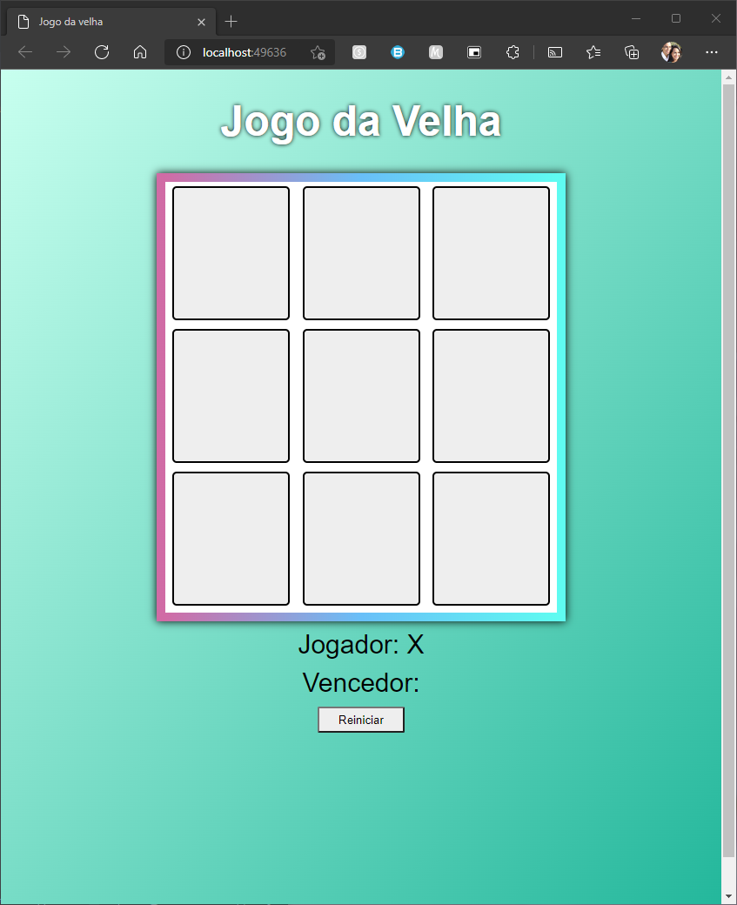

# Jogo da Velha

Jogo da Velha é um jogo de tabuleiro com 9 casas, onde o jogador ganha se preencher três casas na horizontal, vertical ou diagonal, primeiro que outro jogador oponente. Não  é permitido preencher uma casa que já está preenchida.

## Como acessar

[Clique aqui](https://siqueira-gustavo.github.io/jogo-da-velha) para acessar

## Descrição do Projeto

Projeto desenvolvido para o bootcamp **JavaScript Game Developer**, como requisito para a matéria de **Criando seu próprio jogo da velha com HTML e Javascript**.
Bootcamp da [Digital Innovation One](https://digitalinnovation.one).

Neste projeto, utilizou-se as seguintes linguagens:
- HTML;
- CSS;
- Javascript.

## Para rodar o projeto

Para executarmos o projeto, basta apenas abrir o arquivo index.html em um navegador de preferência.
